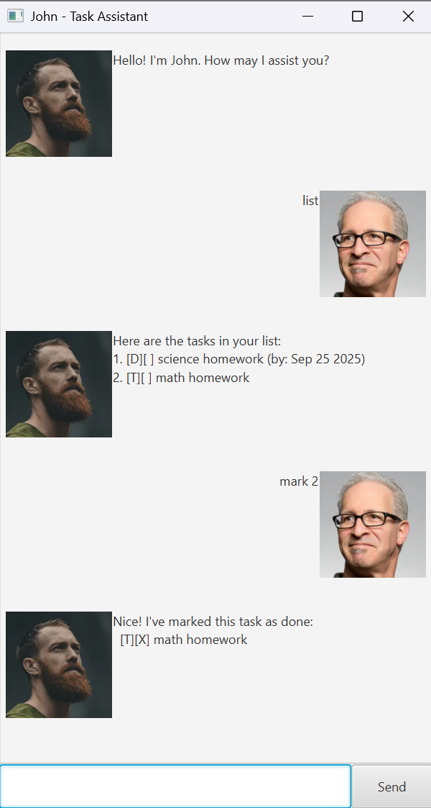

# John — your friendly task assistant

## Quick Start
1. Ensure **Java 17** is installed (`java -version`).
2. Download the latest `john.jar` from **Releases**.
3. Run: `java -jar john.jar`

## Features
- Add todo/deadline/event
- List, mark/unmark, delete, find, sort
- Error-tolerant parsing (explains what went wrong and how to fix)

## Usage (Command Summary)
- `todo TASK`
- `deadline TASK /by DATE`
- `event TASK /from DATE /to DATE`
- `list` | `sort`
- `find KEYWORD` | `delete INDEX`
- `mark INDEX` | `unmark INDEX`
- `bye`

## Troubleshooting
- **Data file missing/corrupt**: app recreates it in `data/`.
- **Wrong command format**: app shows the expected format with examples.

## Development
Build fat jar: `./gradlew clean shadowJar`

## Credits
Based on the CS2103/T iP template. [AI.md](AI.md) documents AI-assisted bits.
